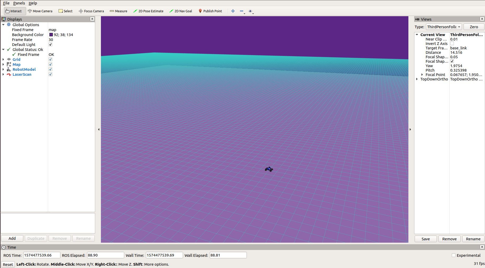

# Homework 1: Introduction

## Overview:


The goal of this assignment is to help you become acquainted with the platforms and other software you’ll use in the programming projects. Please complete this project on your own, so that everyone will have a solid foundation for future projects.

First, you’ll set up the course environment and learn about ROS (including some brief refreshers on using the terminal). Then, you’ll write Python code to interface with ROS, and learn to use the NumPy library to write computationally-efficient code. 

## \# Q1. Your First Publisher Node: Palindrome (30 pts)

Recall that [publishers and subscribers](http://wiki.ros.org/rospy/Overview/Publishers%20and%20Subscribers) are how ROS manages interprocess communication. Publishers send out messages to a topic, while subscribers choose a topic to receive messages from. Publishers and subscribers can even be on different machines in a network, although we won’t take advantage of that feature in these projects.

We will be creating a simple ROS node that check wether an input number is a [palindrome](https://en.wikipedia.org/wiki/Palindrome). It will read an input number from a ROS parameter and publish a boolean value (True, if input number is a palindrome, or False, if not) to a ROS topic. For example, 1001 is a palindrome, and the publisher should publish True. 1234 is not a palindrome, and the publisher should publish False.

**Q1.1**: Implement the `is_palindrome` function in `introduction/src/introduction/palindrome.py`. Make sure your implementation is correct before proceeding to the next question. Your code should pass all tests in `test_palindrome.py`.

To test your code, run
```
$ roscd introduction
$ python3 test/test_palindrome.py
```

<details>
<summary>Rubric</summary>
Deduct 5 points if incorrect. 
</details>


**Q1.2**: We’ve provided an annotated code skeleton to interface with ROS at `introduction/scripts/palindrome`. Follow the instructions inline to complete the code. Your implementation should now also pass `rostest introduction palindrome_small.test`.

<details>
<summary>Rubric</summary>

+ read in parameter (3 pts)
  + incorrect parameter name (-1)
  + check/convert input type to int (minor)
+ publisher definition (3 pts)
  + incorrect message type (-1)
+ call is_palindrome and publish result (4 pts)
  + call is_palindrome() (1.5 pts)
  + call publisher (1.5 pts)
  + missing rospy.spin() (-1)
</details>

**Q1.3**: Finally, we will write a launch file for our node to make it easier to run. Since your `is_palindrome` function requires a ROS parameter to run, you will need to pass it to your node in your launch file. We have provided an annotated skeleton in `introduction/launch/palindome.launch`. Follow the inline instructions to complete the launch file.

<details>
<summary>Rubric</summary>

+ pass in correct parameter (10 pts)
+ should be very simple, all or nothing.
</details>


Let’s run the publisher node and see its output directly. After launching roscore, listen to the output topic. Then, start your palindrome node using `palindrome.launch`. You should see the boolean value appear on the `/introduction/palindrome_output` topic in terminal 2! You can then run the palindrome node with different values for index. Here are the commands to run:
```
$ # In terminal 1
$ roscore
$ # In terminal 2 
$ rostopic echo /introduction/palindrome_output
$ # In terminal 3
$ roslaunch introduction palindrome.launch
$ roslaunch introduction palindrome.launch test_number:=1001
```

## \# 3 Running the MuSHR Car in Simulation
This section will show you how to run the MuSHR simulator and visualize what is going on. Simulators are important because they allow you to test things quickly and without the risk of damaging a robot, the environment, or people. Our simulator uses a kinematic car model (with some noise sprinkled in), meaning it simply implements and integrates some equations that describe the ideal motion of a mechanical system. It will not perfectly reflect the real world dynamics of the car. Regardless, it is still useful for a lot of things.

We’ll run the simulator using a **launch file**. These are XML files that describe how different software components should be started. These files allow us to start a large number of ROS nodes with only few commands. To launch our simulator, open a terminal and run:
```
$ cd ~/homework_ws/
$ source ~/homework_ws/devel/setup.bash
$ roslaunch cs4750 teleop.launch
```
Moving forward, we won’t always spell out that you’ll need to activate the `homework_ws` workspace to do something. But remember that you can’t interact with ROS without having activated a workspace in your terminal. If you try to roslaunch and your terminal says “Command ‘roslaunch’ not found”, you probably forgot to activate the workspace!

Like many `rosXXX` terminal commands, the first argument is the name of a package, and the second is the name of something inside that package (in this case, a launch file).

A small gray window should appear. The simulation is running, you just can’t see it yet!

Let’s try to convince ourselves of this. Open another terminal and run `rosnode list` to see all of the nodes running. Each of those nodes is a separate process. We can see the communication between nodes by examining the **topics** they are **publishing messages** to and **subscribing to** messages from. Messages are packets of information in a specific format that can be routed around a ROS system. Running `rostopic list` will display the names of all the open topics. We can actually see the simulation in action if we look at some of the messages coming from the simulated hardware. Let’s use the `rostopic` helper to view these messages:

```
$ rostopic echo /car/odom
```

Messages will start streaming into your terminal. Now focus on the gray teleop window and use the WASD keys to send commands to the vehicle. W and A move forward and backward, S and D turn the steering wheel left and right. Notice how the numbers are changing in response to your commands?

To stop the simulation, press `<Ctrl-C>` in the `teleop.launch` terminal window.

## \# Visualizing the Simulator

Start the simulation again. To visualize the simulation, open up a separate terminal and run:
```
$ rosrun rviz rviz -d ~/homework_ws/src/cs4750-hw-solutions/cs4750/config/default.rviz
```
If you see error messages in your terminal like “Could not load model…”, remember to activate your workspace!

This will launch RViz with a configuration that has all the right topics visualized. A window like this should appear:

 <figure>
  
  <figcaption>RViz visualizer.</figcaption>
</figure> 

To drive the car, click on the small gray window and use the WASD keys.

In RViz, you will notice multiple panels. The right panel is the views panel. The “Target Frame” option tells the camera what to focus on. If you don’t want it to track the car, you can change it from “base_link” to “map”. The center panel is the view panel; you can zoom, pan, and rotate using the mouse and mouse wheel.

The top panel has a few tools, like Measure and 2D Pose Estimate. 2D Pose Estimate is particularly useful if you want the numerical coordinates of a given position. Just click on it, then click on the map. The terminal that you started RViz in will display the coordinates. You may also notice the car model is relocated there; the simulator listens to the message RViz sends and sets the car position to match.

Finally, the left panel shows all of the ROS topics that RViz is subscribed to. For example, if you toggle off the checkbox for the Map topic, you will no longer see the map visualization (although it’s still being used by the simulator). You can add additional topics by clicking the “Add” button then “By topic”. Try adding the origin axes by adding a topic “By display type”. You will mainly add “By topic” but “By display type” may be useful in situations where the list of topics is too long to look through.

Remember, RViz is a visualizer, not a simulator. You can close RViz, but just like how the world continues when you close your eyes, the simulator will chug ahead. So far, we’ve been using RViz to visualize the ROS data being emitted by the simulator. In other situations, the information could come from the software running on a physical robot.

When you close RViz, it may prompt you to save your changes. Saving in RViz saves the RViz configuration, not the state of the simulator itself. Unless you’ve added new topics that you want visualized when RViz starts up, you probably don’t need to save those changes.


<details>
<summary>Customize Rviz</summary>

If you launch RViz with:

```
$ rviz
```

RViz will load its default configuration (which usually is empty). Try adding the topic that you are interested in, saving the RViz configuration (“File > Save Config”), and relaunching RViz. You should find all of the panels open in the same position, and all parameters like the topics being visualized or the camera position set to the same settings as before.
</details>


## \# Q2: Your First Subscriber: PoseListener (50 pts)
In this question, we’ll combine ROS with the [NumPy](https://numpy.org/doc/stable/user/quickstart.html) and [Matplotlib](https://matplotlib.org/) scientific computing libraries. NumPy makes computations faster by using vectorization, and Matplotlib creates plots and other data visualizations.

We will compute the [Euclidean norm](https://mathworld.wolfram.com/L2-Norm.html) in two ways: with regular Python for loops and with functions from NumPy. The input will be a 2D NumPy array5 of shape (N, D), which contains N vectors each of dimension D. The expected output will be a 1D NumPy array of shape (N,), where each entry is the Euclidean norm of the corresponding vector. For example:

$$
 \left[
 \begin{matrix}
   3 & 4 \\
   5 & 12 \\
   8 & 15
  \end{matrix}
  \right] \rightarrow 
  \left[
 \begin{matrix}
   5 \\
   15 \\
   17
  \end{matrix}
  \right]
$$

**Q2.1**: Complete the `norm_python` function in `introduction/src/introduction/listener.py`. To index into a 2D array, NumPy extends the Python indexing syntax to take in multiple indices, with one for each dimension. If `data` represents the left matrix above, `data[0, 0]` returns 3 and `data[2, 1]` returns 15. Use Python for loops to compute the Euclidean norm and replace the zero entries in `norm`.

<details>
<summary>Rubric</summary>

+ norm_python (10 pts)
+ if incorrect calculation (-3)
+ if incorrect output dimension (-3)
</details>


**Q2.2**: In the same file, complete the `norm_numpy` function. Try to use the NumPy functions [np.sqrt](https://numpy.org/doc/stable/reference/generated/numpy.sqrt.html) and [np.square](https://numpy.org/doc/stable/reference/generated/numpy.square.html).

After completing Q2.1 and Q2.2, expect your code to pass the nosetests_test.test_norms.py test suite.
```
$ rosrun introduction test_norms.py
```

<details>
<summary>Rubric</summary>

+ norm_numpy (10 pts)
+ if incorrect calculation (-3)
+ if incorrect output dimension (-3)
</details>


Run `rosrun introduction compare_norm` to compare the running time of your two implementations on 100 trials. This script will use matplotlib to plot the mean and standard deviation of your run time. Save the figure as `runtime_comparison.png`. 

**Q2.3**: In the `PoseListener` class in the same file, initialize a subscriber to the car’s pose topic. To do so, you will need to pass the topic’s name, the message type being published and a callback function. Each time the subscriber receives a message, it will call the callback function to process the message data.

To find the right topic name to subscribe to, launch the car simulation again and run `rostopic list` to see all the topics being published. There’s one topic containing “car_pose” in its name. To figure out what type of messages are being sent on that topic, use `rostopic info XXX/car_pose`. When you construct the subscriber, pass `self.callback` as the callback function.

<details>
<summary>Rubric</summary>

+ wrong topic name (-3 pts)
+ wrong message type (-3 pts)
+ incorrect callback (-3 pts)
</details>

**Q2.4**: Fill in the `PoseListener.callback` method by extracting the x and y position from the pose messages, then saving them in `self.storage`. To see what a car pose message looks like, run your car in the simulator and `rostopic echo XXX/car_pose`. Alternatively, you can look up the message type being published online to see its fields. Expect your code to pass the last test suite, `rostest introduction test_pose_listener.test`.
<details>
<summary>Rubric</summary>

+ correctly extract possition from message (5 pts)
+ append to self.storage (5 pts)
</details>

**Q2.5**: Now, let’s use the `PoseListener` to actually collect some data! In `introduction/scripts/pose_listener`, we’ve already used matplotlib to plot the xy-locations of your car and save the resulting plot to `locations.png`. Use your norm_numpy function to compute the car’s distance to the origin for all the xy-locations captured by the `PoseListener`. Then, use `matplotlib` to plot this distance as a function of time, and save the resulting plot to 'distances.png'.

First, start `teleop.launch` with the default `sandbox.yaml` map.

```
$ roslaunch cs4750 teleop.launch map:='$(find mushr_sim)/maps/sandbox.yaml'
$ # Or if you previously set the MAP environment variable in your terminal or .bashrc file
$ export MAP='$(find mushr_sim)/maps/sandbox.yaml'
$ roslaunch cs4750 teleop.launch
```

Then, you can use the following launch configuration, which starts a `path_publisher` node (that will make the car follow a trajectory specified in a file) and your subscriber node. While passing the plan file, you can see the car’s movement in `rviz`.
```
$ # In a separate shell
$ roslaunch introduction path_publisher.launch plan_file:='$(find introduction)/plans/XXX.txt'
```
  > Run the above configuration with the figure_8.txt and tight_figure_8.txt plan files. For both plans, save the figures produced by pose_listener for submission: locations.png and distances.png. 

  > Optional: Let your artistic side shine and create your own plan file! If you do, please submit the plan file (and any code you may have used to generate it), as well as the locations.png producted by pose_listener. 

<details>
<summary>Rubric</summary>

+ details in Deliverables section.
</details>

### Deliverables (20 pts)
Answer the following writeup questions in introduction/writeup/README.md, including the figures that you generated above. (Here is the syntax for including an image in Markdown.)
<ol>
<li> Define in your own words what a node, topic, publisher, and subscriber are and how they relate to each other.</li>
<li> What is the purpose of a launch file? </li>
<li> Include the RViz screenshot showing the new map. </li>
<li> Include your runtime_comparison.png figure for the different norm implementations. </li>
<li> Include the locations.png and distances.png figures for the plan figure_8.txt. </li>
<li> Include the locations.png and distances.png figures for the plan tight_figure_8.txt. </li>
<li> Optional: Include your own plan file, any code you wrote to generate it, and the resulting locations.png figure. </li>
</ol>

<details>
<summary>Rubric</summary>

+ Q1: 3 points.
+ Q2: 3 points.
+ Q3: 2 point.
+ Q4: 2 points
+ Q5, Q6: 2.5 pts for each location.png and distances.png.
+ Q7: extra credit: + 5 points
</details>

### Submission 

Gradescope ?

<details>
<summary>Rubric</summary>
<!--All you need is a blank line-->

+ rubric 1
  + rubric
+ markdown list 2
  + rubric
</details>

