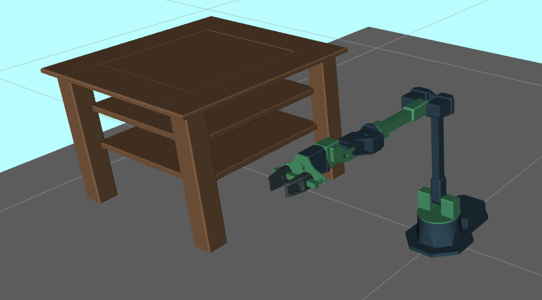

# Homework 4: Planning

## Overview 
In this project, you will implement both A* algorithm and RRT algorithm for MuSHR car and Widowx250 arm robot. While it sounds intimidating, you will soon realize that the planning algorithms can be easily generalized to different platforms.

## Section 1: A* and RRT (50 points)

## \# Code Overview
The first step of motion planning is to define the problem space (`src/planning/problems.py`). This section only considers `PlanarProblems`: `R2Problem`. The `R2Problem` configuration space only considers x- and y- position. The `PlanarProblem` class implements shared functionality, such as collision-checking. The specific problems implement their own heuristic and steering function to connect two configurations. After defining these classes, the rest of your planning algorithm can abstract away these particulars of the configuration space. (To solve a new type of problem, just implement a corresponding problem class.)

The Roadmap class contains many useful methods and fields. Three fields are of particular importance: `graph`, `vertices`, and `weighted_edges`. `Roadmap.graph` is a [NetworkX](https://networkx.org/) graph, either `undirected` or `directed` depending on the problem type. The starter code already handles interacting with this object. Nodes in the NetworkX graph have integer labels. These are indices into `Roadmap.vertices`, a NumPy array of configurations corresponding to each node in the graph. `Roadmap.weighted_edges` is a NumPy array of edges and edge weights; each row `(u, v, w)` describes an edge where `u` and `v` are the same integer-labeled nodes and `w` is the weight (length for R2) of the edge between them.

## \# Q1. Searching the Roadmap (25 points)
The A* algorithm expands nodes in order of their f-value $f(n) = g(n) + h(n)$, where $g(n)$ is the estimated cost-to-come to the node $n$ and $h(n)$ is the estimated cost-to-go from the node $n$ to the goal.

Roadmaps will be given to you. To visualize a simple roadmap, run the following command

```
roscd planning
python3 scripts/roadmap -m test/share/map1.txt -n 25 -r 3.0 --show-edges
```
**Q1.1** Implement the `cost_to_go`, `cost_to_come` function for `R2Problem` class in `planning/src/planning/problems.py`. You implementation should compute the cost estimate between two states in R2 space. (Hint: Euclidean distance, pay attention to inputs' dimension.)

**Q1.2:** Implement the main A* logic in `search.py`. For each neighbor, compute the cost-to-come via the current node (cost-to-come for the current node, plus the length of the edge to the neighbor). Insert a `QueueEntry` with this information into the [priority queue](https://en.wikipedia.org/wiki/Priority_queue) (You can learn more about our provided priority queue in `search.py` line 15-24). Be sure to compute the f-value of the node (cost-to-come plus heuristic) so the priority queue is sorted correctly. Then, implement `extract_path` to follow the parent pointers from the goal to the start; this function is called by A* after the goal has been expanded to finally return the sequence of nodes.

You can verify your implementation on the provided test suites by running `python3 test/astar.py`. Your implementation should pass the `test_astar_r2` suites.

You should now be able to run an A* planner from the start to the goal! The following command specifies that it is an `R2Problem`, planning from the start of (1, 1) to the goal of (7, 8). Your plot should match the reference plot below.

```
$ python3 scripts/run_astar -m test/share/map1.txt -n 25 -r 3.0 --show-edges r2 -s 1 1 -g 7 8
```

 <figure>
  
  <figcaption>A* path in blue on map1.txt, from (1, 1) in green to (7, 8) in red.</figcaption>
</figure> 

> Compute the shortest path on map2.txt between (252, 115) and (350, 350) with the following command: python3 scripts/run_astar -m test/share/map2.txt -n 600 -r 100 r2 -s 252 115 -g 350 350. Include the shortest path figure in your writeup.

<details>
<summary>Rubric</summary>

+ Q1.1 10 point
+ Q1.2 15 point
</details>

## \# Q2. Planning to goal through RRT (25 points)

You will be implementing a Rapidly-Exploring Random Tree (RRT) for the same 2D world. For more details on the algorithm, refer to the reading material on the course website. 

### Code overview
The main algorithms are to be implemented in `RRTPlanner.py`. A class called `RRTTree` is implemented in `RRTTree.py`.

**Q2.1**

Implement the main RRT logic in `search.py`.  First, implement the `extend` function in class `RRTPlanner`. Then, complete the `Plan` function. Specifically, you will need to sample a random point and add vertex/edge accordingly. Upon reaching the goal, you also need to extract the complete plan. 

You should now be able to run a RRT planner from the start to the goal! The following command specifies that it is an R2Problem, planning from the start of (1, 1) to the goal of (8, 8). Your plot should match the reference plot below.

```
$ roscd planning
$ python3 scripts/run_rrt -m test/share/map1.txt -s 1 1 -g 8 8 --show-tree
```
> The --show-tree flag allows you to visualize the growing of your tree in real time. You can also specify how many random samples you want to draw at each iteration by specifying `-size n`, where n is the number of samples. You can also specify step size eta using the flag `-e`.

 <figure>
  
  <figcaption>rrt path in blue on map1.txt, from (1, 1) in green to (8, 8) in red.</figcaption>
</figure> 

> Compute the shortest path on map2.txt between (252, 115) and (350, 350) with the following command: `python3 scripts/run_rrt -m test/share/map2.txt -s 252 115 -g 350 250 --show-tree -size 100`. Include the shortest path figure in your writeup.

Your implementation is expected to pass `python3 test/rrt.py`. 

### **For graduate student only**
**Q2.2** 

RRT planner's output is usually not optimal, and some postprocessing is required. Implement the `ShortenPath()` function in `search.py`. 

Once you finish, add flag `--shortcut` to visualize new plan. Shortcuts will be shown in color blue.

```
python3 scripts/run_rrt -m test/share/map1.txt -s 1 1 -g 8 8 --show-tree --shortcut -e 0.5
```

 <figure>
  
  <figcaption>rrt path in blue on map1.txt, shortcut in red from (1, 1) in green to (8, 8) in red.</figcaption>
</figure> 


<details>
<summary>Rubric</summary>

+ Plan function: 15 points
+ Extend function: 10 points

For graduate student

+ Plan function: 10 points
+ Extend function: 8 points
+ Shortcut: 7 points
</details>


## \# Section 2: Planning for Car (10 points)

So far, we’ve been solving `R2Problems`. But since the MuSHR cars have an orientation, the problems we need to solve are `SE2Problems`, which concerns about both x, y position, and orientation. Thus, your NetworkX graph will have directed edges. The [Dubins path](https://en.wikipedia.org/wiki/Dubins_path) connects two configurations, with a maximum specified curvature<sup>[1](#1)</sup>. Since the Dubins path is directed, the graph will be directed. As a result, more vertices are generally needed for the graph to be connected.

**Q3** Implement the `cost_to_go`, `cost_to_come` function for `SE2Problem` in `src/planning/problems.py`. (Remember to make use of `dubins.path_length()`) You implementation should compute the cost estimate between two states in SE2 space.


You can verify your implementation on the provided test suites by running `python3 test/astar.py`. Your implementation should pass the `test_astar_se2` suites.

To visualize planned path with Dubins path as edges, run
```
python3 scripts/run_astar -m test/share/map1.txt -n 40 -r 4 --show-edges se2 -s 1 1 0 -g 7 8 45 -c 3
```


After you have successfully implemented the `cost_to_go` and `cost_to_come`  method for `SE2Problem`, you should be able to use A* to plan the path for MuSHR car in the maze roadmap.

```
$ roslaunch car_planning planner_sim.launch map:='$(find cs4750)/maps/maze_0.yaml' num_vertices:=1000 connection_radius:=10 curvature:=1
```
 <figure>
  
  <figcaption>Planned path in red.</figcaption>
</figure> 

<details>
<summary>Rubric</summary>

+ 10 points if pass the test
</details>

## \# Planning for Arm

Open a terminal and run 
```
roslaunch widowx250_moveit_config widowx_simple_env.launch use_rviz:=true
```
You should see a widowx250 arm is placed next to a table. In this assignment, you will plan various paths for widowx250 while avoiding hitting the table and floor.

 <figure>
  
  <figcaption>Planning Environment for arm. </figcaption>
</figure> 


## Section 3: Planning for Widowx 250 Arm (40)

At this point, you have successfully implemented both RRT and A* planning algorithms. As you may know, these algorithms are not restricted to any platforms. In fact, they are widely use in robot arms as well. 

Robot arms are different from a car in many ways. Most importantly, we are working with a higher dimensional configuration space. Hence, the definition of distance and heuristics will be different from the car example. 

## \# Q4: Design heuristic function for A* (20)
In this assignment, let's interpret the distance between two robot arm configurations as changes in joint angles. Come up with your own heuristic function in JointSpace.cost_to_go (`problems.py`) to estimate cost to move from one configuration to the target configuration. As in previous question, we have provided you a roadmap to search from.

To visualize your A* planning algorithm
```
$ # In terminal 1, run
$ roslaunch widowx250_moveit_config widowx_simple_env.launch use_rviz:=true

$ # In terminal 2, run
$ rosrun arm_planning astar_planning

$ # Different start and end location
$ rosrun arm_planning astar_planning -s 0 0 0 0 0 0 -g -2.3472 0.9303 -0.8133 1.6733 0.8535 -1.7264
```

> In README, briefly tell us how did you design your heuristic function.

Once a path is found, waypoints of the planned path will be displayed in Rviz. Feel free to use the `Trajectory Slider` in the left bottom pannel of Rviz to visualize your plan sequentially (If the slider did not load the latest trajectory, close it and restart by going to `Panels` (top left of RViz window) -> `Motion Planning - Trajectory Slider`).


<details>
<summary>Hint</summary>

+ sum of (absolute) changes in each joint angle
+ L2 norm for joints
</details>

<details>
<summary>Rubric</summary>

+ 20 points for successfully implementing the cost in joint space.
+ -5 if did not consider the fact that 2pi and 0 are the same.
</details>

## \# Q5: Design distance function for RRT (20 points)
Imagine you work for a frugal company who wants to pay minimum fee for electricity. Your manager asked you to design a distance function for rrt to take into account energy(current) consumption for motors at each joint. For each motor, the amount of current consumed is proportional to the change in joint angles. Moreover, it also related to the amount of weight that specific joint needs to support. (Motor located at shoulder joint will consume more enegy per rotation than motor located at wrist, since shoulder joint supports more weight than the wrist joint.)

Now, suppose that the ratio of electricity consumption is `30%`, `25%`, `20%`, `15%`, `8%`, and `2%` for motors at joint `waist`,`shoulder`, `elbow`, `forearm_roll`, `wrist_pitch`, and `wrist_roll`. Design a distance function (`JointSpace.compute_distance()`) in `problems.py` to help your manager and get a promotion!

After implementing your cost function, test it and see what path it will find!

```
$ # In terminal 1, run
$ roslaunch widowx250_moveit_config widowx_simple_env.launch use_rviz:=true

$ # In terminal 2, run
$ rosrun arm_planning rrt_planning
$ # different step size, eta
$ rosrun arm_planning rrt_planning -e 0.8
$ # Different start and end location
$ rosrun arm_planning rrt_planning -s 0 0 0 0 0 0 -g -2.3472 0.9303 -0.8133 1.6733 0.8535 -1.7264 -e 0.5 
```

> run `rosrun arm_planning rrt_planning -s 0 0 0 0 0 0 -g -2.3472 0.9303 -0.8133 1.6733 0.8535 -1.7264 -e 0.5` a few times with different eta value and copy your cost from terminal window to `README`. Show us your lowest cost and corresponding eta value. (We do not have a specific threshold for this cost since you are the designer! Just show us your lowest cost!)

> In README, briefly tell us how do you design your distance function.


<details>
<summary>Rubric</summary>

+ 20 points for successfully implementing the cost in joint space.
+ Ratios can be 0.3, 0.25,... or 30, 25, ...
+ -5 if doesn't consider the fact that 2*pi and 0 are the same
</details>


<a name="1">1</a>  The curvature is the inverse of the arc radius, so it has units of meters-1. Therefore, a maximum curvature corresponds to a minimum turning radius.
